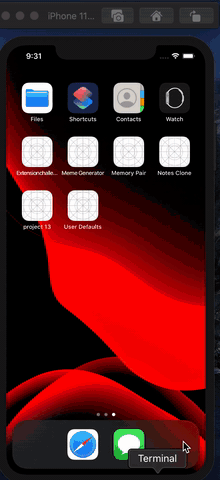

# Memory-Pairs-Game

This project is a Memory pair game in UIKIT. In this game first, user clicks on image then flag hidden in image shown to the user then user click on another image if flag
under the other image matches with first flag image then the user gets a score. If two pictures don't match, after 1-second images change back to question mark.

I used animation to flip the images, and the collection view controller is used for displaying the images.

### Demo

